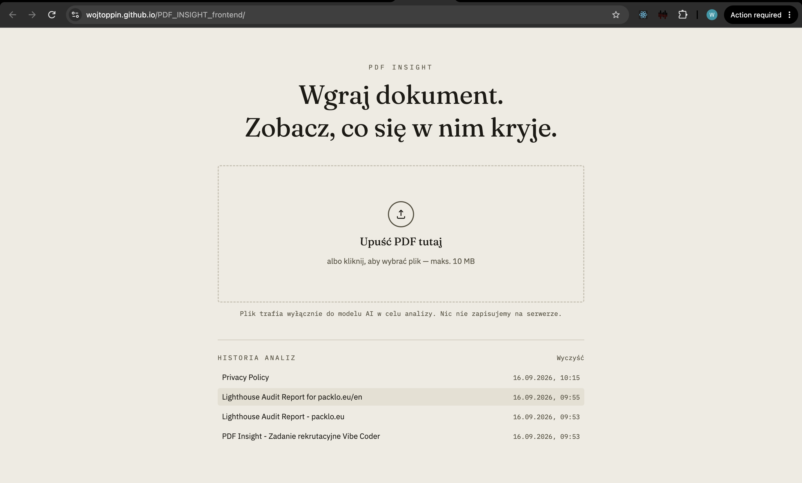

# PDF Insight

Upload a PDF, get a summary and structured data (entities, amounts, dates, keywords) out of it in seconds. Recruitment task for the Vibe Coder position — brief: `Brief_Vibe_Coder_PDF_Insight.pdf`.

**Live demo:** https://wojtoppin.github.io/PDF_INSIGHT_frontend/



## How it works

```
Browser (React SPA, GitHub Pages)
  -> POST /api/analyze (FastAPI backend, Railway)
  -> Google Gemini
```

GitHub Pages only serves static files, so the browser never talks to Gemini directly — it posts the PDF to a small backend that extracts the text, calls Gemini, validates the response, and returns JSON matching the brief's schema (section 04). The Gemini API key lives only in that backend's environment.

The backend is a **separate repository**: [`PDF_INSIGHT_backend`](https://github.com/Wojtoppin/PDF_INSIGHT_backend) (FastAPI + PyMuPDF + Gemini, Dockerized, deployed on Railway). This repo is frontend-only.

## Architecture & decisions

- **React 19 + TypeScript (strict) + Vite + Tailwind v4.** No `react-router` — this is a genuine one-pager (upload → result, one screen), so a router would be dead weight.
- **Zustand** (`store/analysisStore.ts`) drives a small state machine: `idle -> processing -> success | error`, plus a `history` slice for the last 5 analyses.
- **Zod is the single source of truth for the data contract.** Every schema object lives in its own file under `src/types/documentAnalysis.schema/`, composed into the top-level schema. Every response — from the backend or from `localStorage` — is parsed through it before touching a component. Dates are validated as real ISO 8601 (`z.iso.date()`), currency codes and language codes are validated by regex, not just checked for length.
- **No client-side retry on a failed analysis.** The backend already retries once internally on a bad Gemini response (per the brief's rule); retrying again from the client would double that up and would be actively wrong on a `429`. Instead, every non-2xx response is mapped to `kind: "file"` (pick another file — bad PDF, no text layer, oversized, prompt-injection rejection) or `kind: "transient"` (worth retrying the same file — rate limit, server error, network failure), and the UI offers the matching action.
- **Design concept — "paper & highlighter."** The product's actual job is highlighting insight inside a document, so the UI is built around that literal metaphor (paper-toned background, ink-black type, marker-yellow accent for extraction, a red rejection stamp for errors) instead of a generic dark+neon or cream+terracotta default. The signature moment: results reveal with an animated highlighter-stroke sweeping behind each key point.
- **History (F-09) lives in `localStorage` only** — last 5 analyses, newest first, re-validated through the Zod schema on every read so a stale or corrupted entry gets silently dropped instead of crashing the app. Only the structured result is stored, never the PDF itself.
- **Two repos, not a monorepo.** The brief's stack line is "backend dowolny," and keeping the backend fully independent (own repo, own Dockerfile, own deploy) means it can be swapped or redeployed without touching the frontend's GitHub Pages pipeline. See `PDF_INSIGHT_backend`'s own README for its architecture notes.

Full engineering conventions (folder-by-folder purpose, non-negotiables, CI/CD) are documented in [`CLAUDE.md`](CLAUDE.md).

## Running locally

```bash
npm install
cp .env.example .env   # set VITE_API_URL to a running backend instance
npm run dev
```

| Script                            | Does                                              |
| --------------------------------- | ------------------------------------------------- |
| `npm run dev`                     | Vite dev server                                   |
| `npm run build`                   | Type-check + production build                     |
| `npm run lint`                    | ESLint                                            |
| `npm run format` / `format:check` | Prettier                                          |
| `npm run test`                    | Vitest — schema validation + file/history helpers |

`VITE_API_URL` must point at a running instance of [`PDF_INSIGHT_backend`](https://github.com/Wojtoppin/PDF_INSIGHT_backend) (see that repo for how to run it locally — `uvicorn`, needs a `GEMINI_API_KEY`). Without it, the app loads fine but every upload fails with a connection error.

Deployment is automatic: every push to `main` runs lint → format:check → test → build → deploy via `.github/workflows/deploy.yml`, publishing to GitHub Pages. The backend URL used in the live build comes from the `VITE_API_URL` repository variable (Settings → Secrets and variables → Actions → Variables), not a secret — it ends up in the public JS bundle either way, since the browser has to call it directly.

## Known limitations

- **No OCR.** Scanned PDFs with no extractable text layer are rejected with a clear error (F-10 is a "could," intentionally skipped).
- **No chunking for long documents.** One PDF → one Gemini call; very long documents aren't split and merged (F-08, also a "should," skipped to protect the deadline).
- **History is per-browser, not synced.** It's `localStorage`, so it doesn't follow you across devices or browsers, and clearing site data clears it.
- **Currency/language validation is shape-only.** `PLN`/`USD`-style codes are checked against the ISO 4217 _format_ (3 uppercase letters) and ISO 639-1 _format_ (2 lowercase letters), not against the real code lists — a fictional-but-well-formed code like `"ZZZ"` would still pass.
- **Two repositories.** Submission includes both `PDF_INSIGHT_frontend` (this repo) and `PDF_INSIGHT_backend` — see the backend repo for its own `AI_LOG.md` and README.
